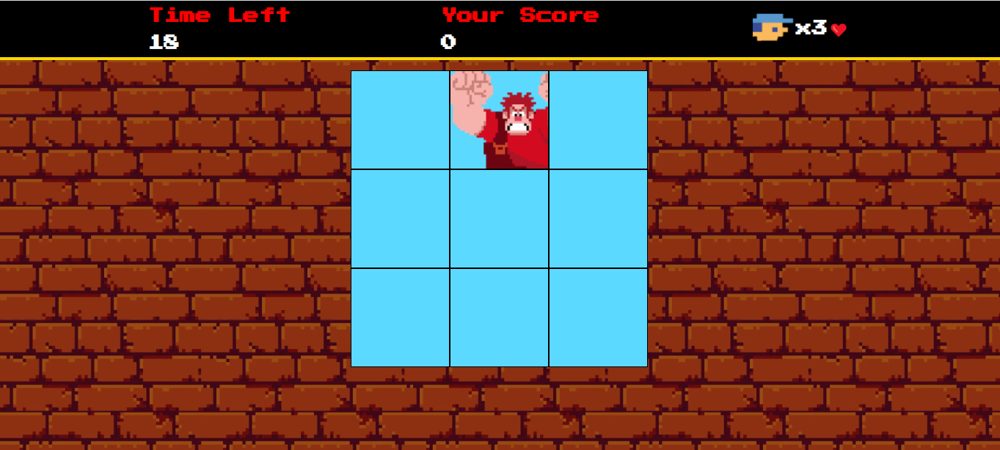

## 🎮 Projeto Jogo Detona Ralph
Desafio de projeto proposto pelo expert Felipe Aguiar da plataforma da DIO (Digital Innovation One). O objetivo desse projeto é criar um jogo com HTML, CSS e JavaScript.

## 💻 Tecnologias usadas

  
  
  

## 🖥 Preview do Jogo:

- Venha jogar acessando [aqui nesse link do GithubPages]()

## ⚙ Execução do Jogo
1. **Clonar Repósitório:** basta utilizar o comando `git clone` para clonar esse projeto e salvar na máquina e depois executar o arquivo `index.html`.
2. **GitHubPages:** pode também acessar o projeto nesse [link](), que abrirá esse projeto no GitHubPages, sem precisar baixar o repositório na sua máquina.

## 🕹 Como jogar
- O objetivo do jogo é clicar, usando o mouse, no personagem Ralph toda vez que ele aparecer. Cada click certo conta um ponto;
- O jogo tem duração de 20 segundos;
- O jogador tem 3 vidas, cada erro diminui uma vida. Caso o jogador tenha zerado todas as suas vidas, o jogo é encerrado e é iniciado uma nova partida.

## 📌 Créditos
- **Assets**: Disponível no [repósitório GitHub DIO](https://github.com/digitalinnovationone/jsgame-detona-ralph/tree/main);
- **Áudio do erro:** Disponível no site [Myinstants](https://www.myinstants.com/pt/instant/windows-xp-error/)